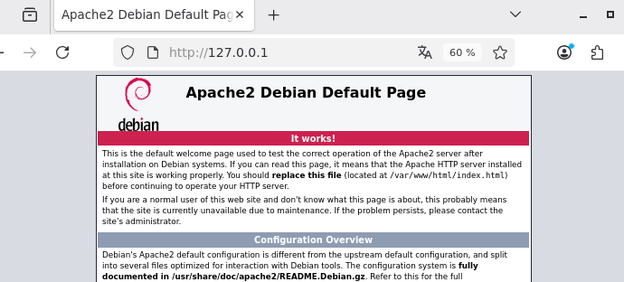
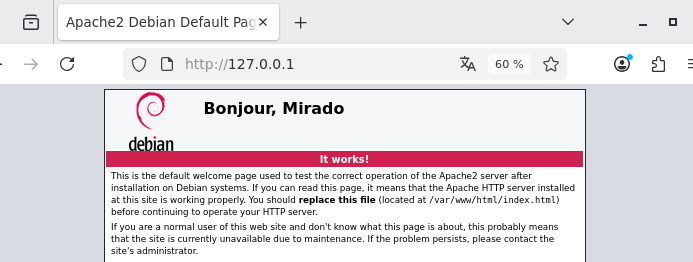
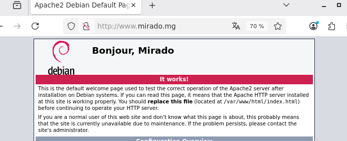

# TP Apache2 — Installation et configuration d'un nom de domaine local

## Objectif

Ce TP couvre l'installation du serveur web Apache2, la modification d'une page par défaut, et la configuration d'un nom de domaine local via `/etc/hosts`.

## 1. Installation d'Apache2

```bash
sudo apt install apache2
```
## 2. Vérifier la résolution du nom d'hôte

```bash
getent hosts
```
Vérifie comment le système résout les noms d'hôtes (via `/etc/hosts` et/ou DNS).

## 3. Accéder au serveur depuis le navigateur

Une fois Apache2 installé et démarré, ouvrir dans le navigateur :
```
http://<IP-de-la-machine>
```
La page par défaut d'Apache2 s'affiche, confirmant que le serveur fonctionne.


## 4. Modifier la page d'accueil

```bash
sudo nano /var/www/html/index.html
```
Modification du titre de la page.



Recharger la page dans le navigateur pour voir le changement appliqué.

## 5. Ajouter un nom de domaine local

```bash
sudo nano /etc/hosts
```
Ajout d'une ligne associant l'IP de la machine à un nom de domaine personnalisé, par exemple :
```
127.0.0.1   www.mirado.mg
```

En rechargeant la page via `http://www.mirado.mg`, le même site s'affiche — le nom de domaine pointe maintenant vers le serveur local.


## 6. Configuration du VirtualHost SSL

```bash
sudo nano /etc/apache2/sites-available/default-ssl.conf
```
## Démo
[](https://asciinema.org/a/NopfLAIAQIWGg6oY)
